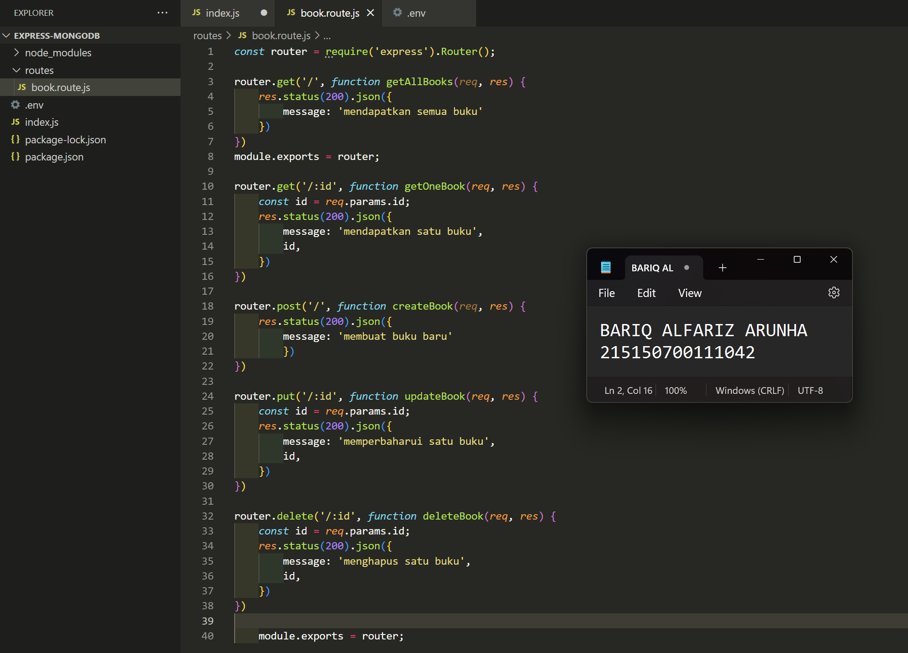
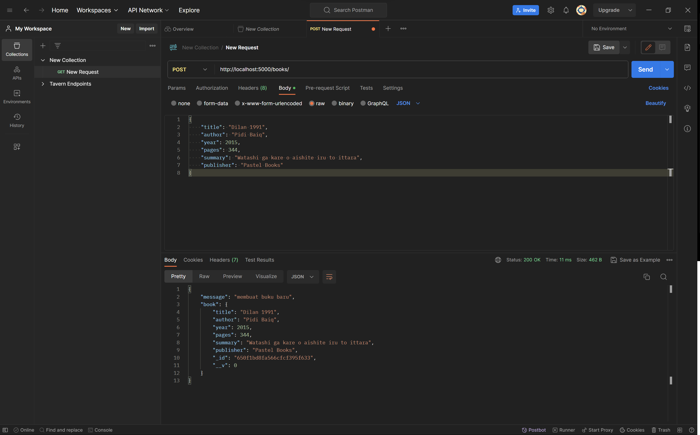

# :ledger: Praktikum Integrasi MongoDB dan Express
Praktikum ini dilakukan pada 20 September 2023. Pada repository ini berisikan source code dan screenshot penerapan dari praktikum modul 3 mengenai Integrasi MongoDB dan Express

## Dasar Teori
### Express

Express.js adalah framework web app untuk Node.js yang ditulis dengan bahasa pemrograman JavaScript. Framework open source ini dibuat oleh TJ Holowaychuk pada tahun 2010 lalu. 

Express.js adalah framework back end. Artinya, ia bertanggung jawab untuk mengatur fungsionalitas website, seperti pengelolaan routing dan session permintaan HTTP, penanganan error, serta pertukaran data di server.

### Mongoose

Mongoose adalah pustaka berbasis Node.js yang digunakan untuk pemodelan data pada MongoDB. Mongoose menyediakan feature diantaranya, model data application berbasis Schema. Dan juga termasuk built-in type casting, validation, query building, business logic hooks dan masih banyak lagi yang menjadi ke andalan mongoose.

### Async Await

Async sendiri merupakan sebuah fungsi yang mengembalikan sebuah Promise. Await sendiri merupakan fungsi yang hanya berjalan di dalam Async. Await bertujuan untuk menunda jalannya Async hingga proses dari Await tersebut berhasil dieksekusi.

### Model

Model merupakan bagian yang bertugas untuk menyiapkan, mengatur, memanipulasi, dan mengorganisasikan data yang ada di database.

### Controller

Controller merupakan bagian yang menjadi tempat berkumpulnya logika pemrograman yang digunakan untuk memisahkan organisasi data pada database. Dalam beberapa kasus, controller menjadi penghubung antara model dan view pada arsitektur MVC

### Route

Router mengatur pintu masuk yang berupa request pada aplikasi, mereka memilah dan mengolah request url untuk kemudian diproses sesuai dengan tujuan akhir url tersebut. Bisa jadi url tersebut berfungsi untuk mengambil data kemudian menampilkannya, menghapus data, menampilkan form, sampai mengolah session.

## Langkah Percobaan 
### Instalasi NodeJS
1. Setelah instalasi selesai jalankan command   `node -v`   untuk memeriksa apakah NodeJS sudah terinstall

### Inisiasi project Express dan pemasangan package
1. Buat folder dengan nama express-mongodb lalu masuk ke dalamnya

2. Melakukan generate file package.json dengan menggunakan command  `npm init -y`

3. Instalasi express, mongoose dan dotend dengan menggunakan command `npm i express mongoose dotenv`

    

### Koneksi Express ke MongoDB
1. Buat file **index.js** pada root folder dan masukkan kode :

2. Pembuatan file **.env** dan masukkan baris berikut :

    Setelah itu ubah kode pada listening port menjadi seperti berikut dan dicoba jalankan kembali

3. Copy connection string yang terdapat pada compass atau atlas dan paste pada **.env** 

4. Tambahkan baris kode pada file **index.js**

### Pembuatan Routing
1. Pembuatan direktori routes di tingkat yang sama dengan index.js
2. Buat file book.route.js di dalamnya
3. Tambahkan bari kode untuk getAllBooks

4. Lakukan hal yang sama untuk getOneBook, createBook, updateBook, dan deleteBook

5. Lakukan import book.route.js pada file index.js dan tambhkan baris kode berikut

6. Uji coba salah satu endpoint dengan Postman

### Pembuatan Controller
1. Melakukan pembuatan direktori controllers di tingkat yang sama dengan index.js
2. Buat file book.controller.js di dalamnya
3. Masukkan baris kode dari routes untuk fungsi getAllBooks

4. Melakukan hal yang sama untuk getOneBook, createBook, updateBook, dan deleteBook

5. Melakukan import book.controller.js pada file book.route.js
6. Melakukan perubahan pada fungsi agar dapat memanggil fungsi dari book.controller.js

7. Melakukan pengujian kembali dan pastikan response tetap sama

### Pembuatan Model
1. Melakukan pembuatan direktori models di tingkat yang sama dengan index.js
2. Membuat file book.model.js di dalamnya
3. Menambahkan baris kode seperti berikut

### Operasi CRUD
1. Hapus semua data pada collection books 

2. Melakukan import book.model.js pada file book.controller.js
3. Melakukan perubahan pada fungsi createBook

4. Membuat dua buah buku dengan data di bawah ini menggunakan Postman

    Menambahkan buku kedua 

5. Melakukan perubahan pada fungsi getAllBooks

6. Melakukan perubahan pada fungsi getOneBook

7. Menampilkan semua buku dengan Postman

8. Menampilkan buku Dilan 1990 dengan Postman

9. Melakukan perubahan pada fungsi updateBook

10. Mengubah judul buku Dilan 1991 menjadi `Nama Panggilan` dengan Postman

11. Melakukan perubahan pada fungsi deleteBook

12. Menghapus buku Dilan 1990 dengan Postman

