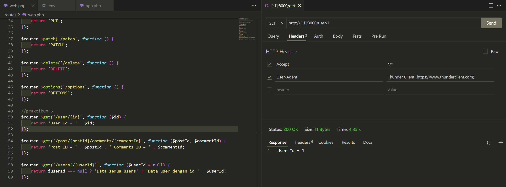
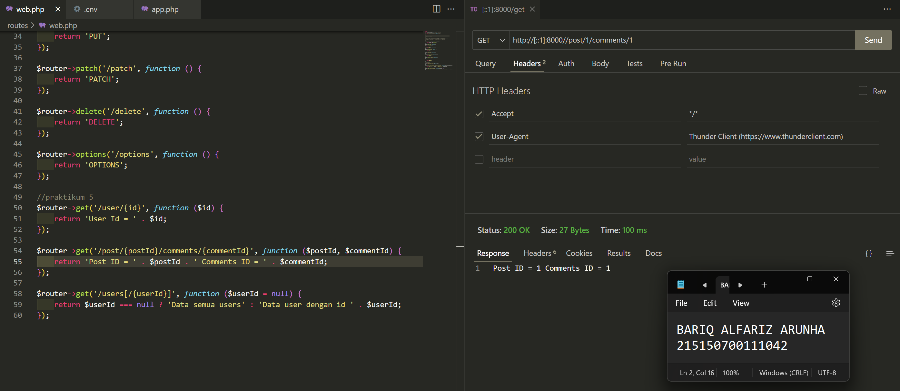
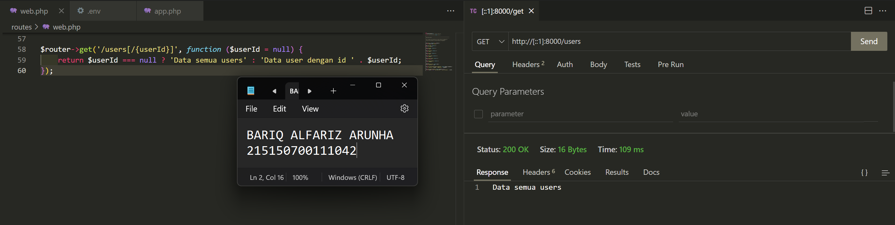
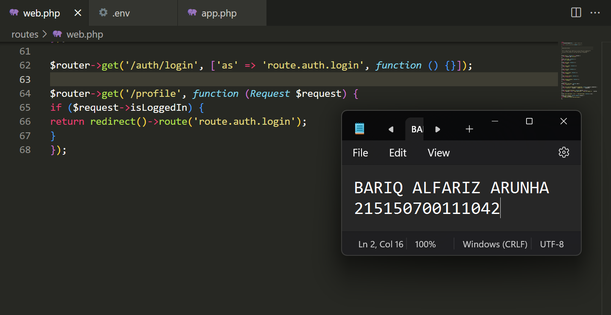
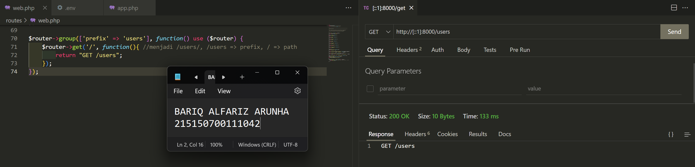
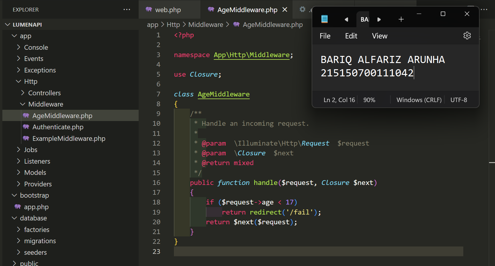
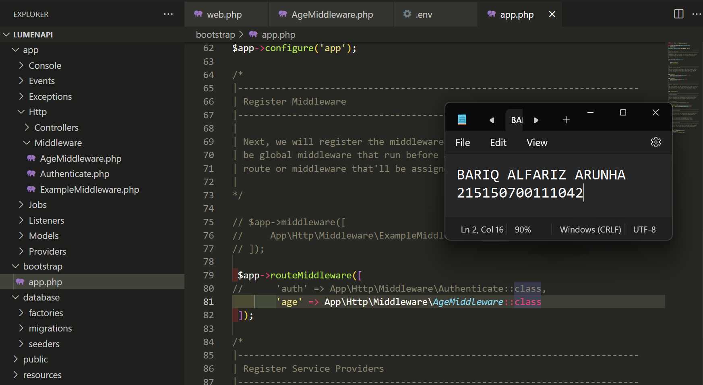
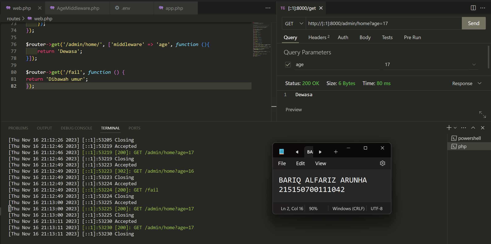

# :ledger: Praktikum Basic Routing dan Migration
Praktikum ini dilakukan pada 4 Oktober 2023. Pada repository ini berisikan source code dan screenshot penerapan dari praktikum modul 5 mengenai Dynamic Route dan Middleware

## Tujuan
Setelah mengikuti praktikum ini, mahasiswa diharapkan dapat:
1. Melakukan dinamic routing.
2. Melakukan alias route.
3. Melakukan group route.
4. Melakukan Middleware

## Langkah Percobaan
1. Dynamic Route

    Dynamix Route adalah route yang dapat berubah-ubah, contohnya pada saat kita membuka suatu halaman web, kadang kita melihat /users/1 atau /users/2 , hal ini yang dinamakan dynamic routes. Untuk menambahkan dynamic routes pada aplikasi lumen kita, kita dapat menggunakan syntax berikut : 

    

    Saat menambahkan parameter pada routes, kita tidak terbatas pada 1 variable saja, namun kita dapat menambahkan sebanyak yang diperlukan seperti kode berikut:

    

    Pada dynamic routes kita juga bisa menambahkan optional routes, yang mana optional routes tidak mengharuskan kita untuk memberi variable pada endpoint kita, namun saat kita memanggil endpoint, dapat menggunakan parameter variable ataupun tidak, seperti pada kode dibawah ini

    

2. Aliases Route

    Aliases Route digunakan untuk memberi nama pada route yang telah kita buat, hal ini dapat membantu kita, saat kita ingin memanggil route tersebut pada aplikasi kita. Berikut syntax untuk menambahkan aliases route
    

3. Group Route

    Pada lumen, kita juga dapat memberikan grouping pada routes kita agar lebih mudah pada saat penulisan route pada web.php kita. Kita dapat melakukan grouping dengan menggunakan syntax berikut,

       

    Selain dapat mengelompokkan prefix, kita juga dapat mengelompokkan middleware dan namespace pada kelompok routes kita.

4. Middleware
    Middleware adalah penengah antara komunikasi aplikasi dan client. Middleware biasanya digunakan untuk membatasi siapa yang dapat berinteraksi dengan aplikasi kita dan semacamnya, kita dapat menambahkan middleware dengan menambahkan file pada folder `app/Http/Middleware`. Pada folder tersebut terdapat file `ExampleMiddleware` , kita dapat men-copy file tersebut untuk membuat middleware baru.

    Pada praktikum kali ini akan dibuat middleware Age dengan isi,

    

    Kemudian, setelah menambahkan filter pada `AgeMiddleware` , kita harus mendaftarkan `AgeMiddleware` pada aplikasi kita, pada file `bootstrap/app.php` seperti berikut ini,

    

    Pada praktikum ini kita menambahkan middleware pada routes dan kita uji coba dengan memasukkan request age 16 dan 17 menghasilkan hasil yang berbeda seperti berikut

    
