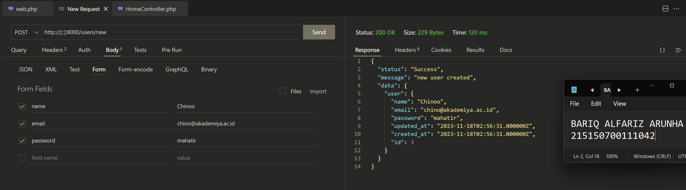

# :ledger: Praktikum Model, Controller dan Request-Response Handler
Praktikum ini dilakukan pada 11 Oktober 2023. Pada repository ini berisikan source code dan screenshot penerapan dari praktikum modul 6 mengenai Model, Controller dan Request-Response Handler

## Tujuan
Setelah mengikuti praktikum ini, mahasiswa diharapkan dapat:
1. Mengimplementasikan model
2. Mengimplementasikan controller
3. Mengimplementasikan request handler
4. Mengimplementasikan response handler

## Dasar Teori
### Model

Model merupakan bagian yang bertugas untuk menyiapkan, mengatur, memanipulasi, dan mengorganisasikan data yang ada di database. Model merepresentasikan kolom apa saja yang ada pada databas, termasuk relasi dan primary key dapat didefinisikan di dalam model. Dengan menggunakan perintah Artisan, pembuatan model pada Laravel dapat dilakukan dengan satu perintah menggunakan

`php artisan make:model nama_model`

Namun karena perintah Artisan yang terbatas pada Lumen, pembuatan model harus dilakukan secara manual.

### Controller

Controller merupakan bagian yang menjadi tempat berkumpulnya logika pemrograman yang digunakan untuk memisahkan organisasi data pada database. Dalam beberapa kasus, controller menjadi penghubung antara model dan view pada arsitektur MVC

### Request Handler

Request handler adalah fungsi yang digunakan untuk berinteraksi dengan request yang datang. Request handler dapat digunakan untuk melihat apa saja yang dikirimkan oleh user seperti parameter, query, dan body.

### Response Handler

Response handler adalah fungsi yang digunakan untuk membentuk output yang diharapkan kepada user dan beberapa properti selain data seperti status code dan header.

## Langkah Percobaan
### Model
1. Pastikan terdapat tabel users yang dibuat menggunakan migration pada bab sebelumnya. Berikut informasi kolom yang harus ada
    

2. Bersihkan isi User.php yang ada sebelumnya dan isi dengan baris kode berikut
    

### Controller
1. Buatlah salinan `ExampleController.php` pada folder `app/Http/Controllers` dengan nama `HomeController.php` dan buatlah fungsi `index()` yang berisi
    

2. Ubah route `/` pada file `routes/web.php` menjadi seperti ini
    

3. Jalankan aplikasi
    

### Request Handler
1. Lakukan import library Request dengan menambahkan baris berikut di bagian atas file
    

2. Ubah fungsi index menjadi
    

3. Jalankan aplikasi
    

### Response Handler
1. Lakukan import library Response dengan menambahkan baris berikut di bagian atas file
    

2. Buatlah fungsi `hello()` yang berisi
    

3. Tambahkan route `/hello` pada file `routes/web.php`
    

4. Jalankan aplikasi pada route `/hello`
    

### Penerapan
1. Lakukan import model User dengan menambahkan baris berikut di bagian atas file
    

2. Tambahkan ketiga fungsi berikut di `HomeController.php`
    

3. Tambahkan ketiga route pada file `routes/web.php` menggunakan group route
    
    
4. Jalankan aplikasi pada route `/users/default` menggunakan Thunder Client / Postman
    

5. Jalankan aplikasi pada route `/users/new` dengan mengisi body sebagai berikut
    

6. Jalankan aplikasi pada route `/users/all`
    