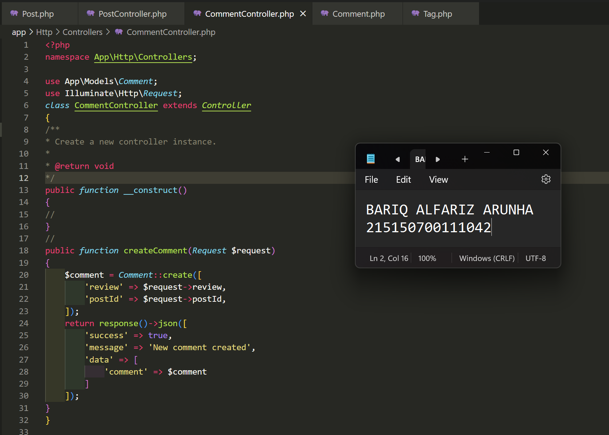
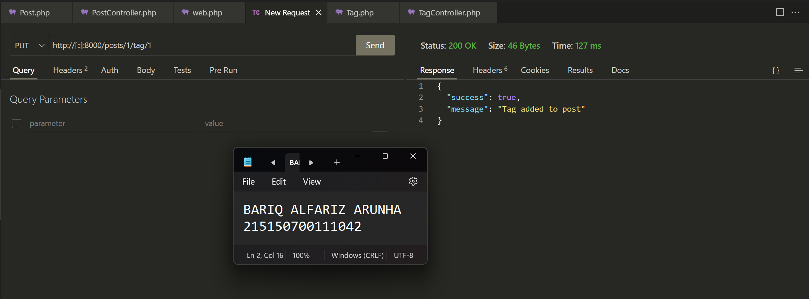
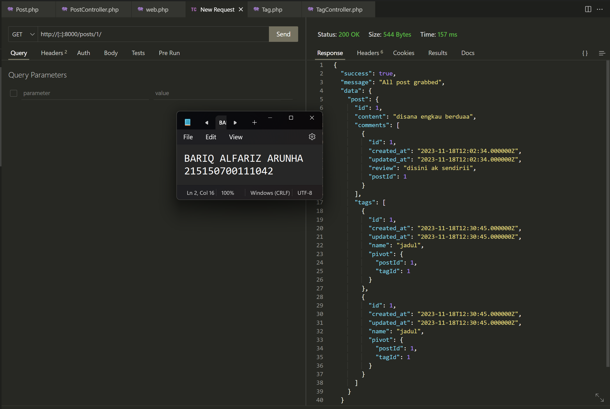

# :ledger: Praktikum Relasi One-to-Many dan Many-to-Many
Praktikum ini dilakukan pada 18 Oktober 2023. Pada repository ini berisikan source code dan screenshot penerapan dari praktikum modul 7 mengenai Relasi One-to-Many dan Many-to-Many

## Tujuan
Setelah mengikuti praktikum ini, mahasiswa diharapkan dapat:
1. Memahami relasi dan foreign key
2. Mengimplementasikan relasi one-to-many
3. Mengimplementasikan relasi many-to-many

## Dasar Teori
### Relasi

Hubungan antar tabel yang dilakukan dengan pencocokan primary key dengan foreign key untuk mengombinasikan data dari satu tabel dengan tabel lainnya.

### Foreign Key

Properti yang digunakan untuk menandai hubungan dua tabel atau lebih. Foreign key pada tabel anak (child) akan menunjuk tabel induk (parent) yang menjadi referensinya(reference).

### One-to-Many

Relasi yang menunjukkan hubungan antar tabel dimana baris pada tabel induk dapat terhubung dengan satu atau lebih baris di tabel anak. Sementara baris pada tabel anak hanya dapat terhubung dengan satu baris di tabel induk.

Contoh penerapan one-to-many

- Satu tutorial dapat memiliki banyak komentar, namun satu komentar hanya dapat berada di satu tutorial
- Satu dosbing dapat memiliki banyak mahasiswa, namun mahasiswa hanya dapat dibimbing satu dosen

### Many-to-Many

Relasi yang menunjukkan hubungan antar tabel dimana baris pada tabel induk dapat terhubung dengan satu atau lebih baris di tabel anak. Berlaku sebaliknya pada tabel anak yang dapat terhubung dengan satu atau lebih baris di tabel induk.

Contoh penerapan many-to-many
- Satu mahasiswa dapat mengambil banyak mata kuliah, namun satu mata kuliah dapat diambil banyak mahasiswa
- Postingan dapat memiliki banyak tag, namun satu tag dapat dimiliki banyak postingan.

    

Kombinasi baris pada relasi many-to-many diatur dengan junction table.

### Junction Table

Tabel yang digunakan untuk mengatur kombinasi baris pada relasi many-to-many. Junction table berisi foreign key dari kedua tabel yang memiliki relasi many-to-many.
Contoh penerapan junction table adalah tabel Enrollment pada relasi many-to-many di atas

## Langkah Percobaan
### Pembuatan Tabel
Berikut adalah tabel yang akan digunakan pada percobaan ini
<table>
 	<tr>
 		<td> posts </td>
		<td> comments </td>
		<td> tags </td>
		<td> post_tag </td>
 	</tr>
 	<tr>
 		<td> id </td>
		<td> id </td>
		<td> id </td>
		<td> postId </td>
 	</tr>
  <tr>
 		<td> content(STRING) </td>
		<td> review(STRING) </td>
		<td> name </td>
		<td> tagId </td>
 	</tr>
  
  
 </table> 

1. Sebelum membuat migrasi database atau membuat tabel pastikan server database aktif kemudian pastikan sudah membuat database dengan nama `lumenapi`
    

2. Kemudian ubah konfigurasi database pada file ``.env`` 
    

3. Menghidupkan beberapa library bawaan dari lumen dengan membuka file ``app.php`` pada folder ``bootstrap``
    

4. Setelah itu jalankan command berikut untuk membuat file migration
    

5. Ubah fungsi ``up()`` pada file migrasi ``create_posts_table``
    
    
6. Ubah fungsi ``up()`` pada file ``create_comments_table``
    

7. Ubah fungsi ``up()`` pada file ``create_tags_table``
    

8. Ubah fungsi ``up()`` pada file ``create_post_tag_table``
    

9. Kemudian jalankan command ``php artisan migrate``
    

### Pembuatan Model
1. Buatlah file dengan nama ``Post.php`` dan isi dengan baris kode berikut
    

2. Buatlah file dengan nama ``Comment.php`` dan isi dengan baris kode berikut
    

3. Buatlah file dengan nama ``Tag.php`` dan isi dengan baris kode berikut
    

### Relasi One-to-Many
1. Tambahkan fungsi ``comments()`` pada file ``Post.php``
    

2. Tambahkan fungsi ``post()`` dan atribut postId pada ``$fillable`` pada file ``Comment.php``
    

3. Buatlah file ``PostController.php`` dan isilah dengan baris kode berikut
    

4. Buatlah file ``CommentController.php`` dan isilah dengan baris kode berikut
    

5. Tambahkan baris berikut pada ``routes/web.php``
    

6. Buatlah satu post menggunakan Postman / Thunder Client
    

7. Buatlah satu comment menggunakan Postman / Thunder Client
    

8. Tampilkan post menggunakan Postman / Thunder Client
    

### Relasi Many-to-Many
1. Tambahkan fungsi ``tags()`` pada file ``Post.php``
    

2. Tambahkan fungsi ``posts()`` pada file ``Tag.php``
    
    
3. Buatlah file ``TagController.php`` dan isilah dengan baris kode berikut
    
    
4. Tambahkan fungsi ``addTag`` dan response tags pada ``PostController.php``
    
    
5. Tambahkan baris berikut pada ``routes/web.php``
    
    
6. Buatlah satu tag menggunakan Postman / Thunder Client
    
    
7. Tambahkan tag ``jadul`` pada post ``disana engkau berdua``
    
    
8. Tampilkan post ``disana engkau berdua`` menggunakan Postman
    
    
9. Buatlah postingan ``tanpamu apa artinya`` menggunakan Postman
    
    
10. Tambahkan tag ``jadul`` pada postingan ``tanpamu apa artinya``
    
    
11. Buatlah tag ``lagu`` menggunakan Postman
    
    
12. Tambahkan tag ``lagu`` pada postingan ``tanpamu apa artinya``
    
    
13. Tampilkan post pertama
    
    
14. Tampilkan post kedua
    
    