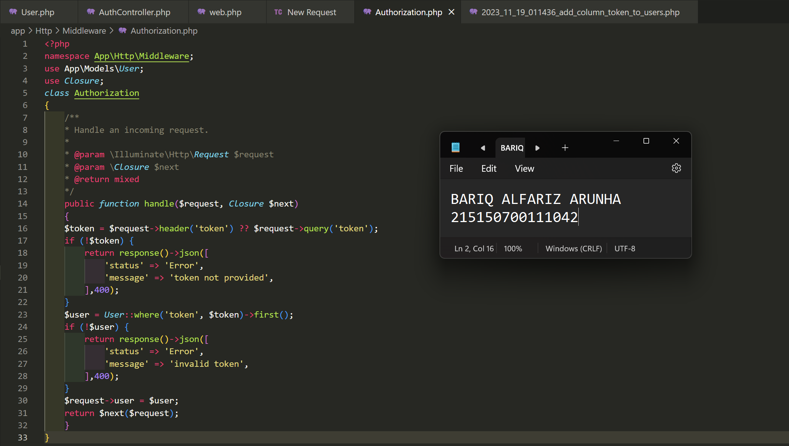
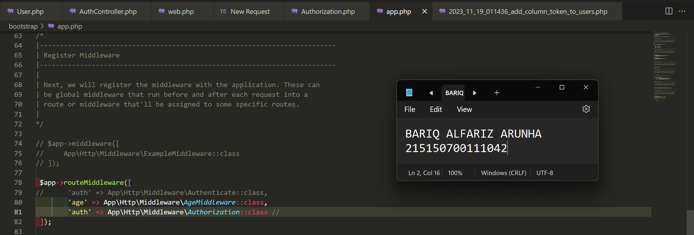

# :ledger: Praktikum Register, Authentication dan Authorization
Praktikum ini dilakukan pada 25 Oktober 2023. Pada repository ini berisikan source code dan screenshot penerapan dari praktikum modul 8 mengenai Register, Authentication dan Authorization

## Tujuan
Setelah mengikuti praktikum ini, mahasiswa diharapkan dapat:
1. Mengimplementasikan register
2. Mengimplementasikan authentication
3. Memahami fungsi token
4. Mengimplementasikan authorization

## Dasar Teori
### Authentication

Otentifikasi adalah proses untuk mengenali identitas dengan mekanisme pengasosiasian permintaan yang masuk dengan satu set kredensial pengidentifikasi.
Kredensial yang diberikan akan dibandingkan dengan database informasi pengguna yang berwenang di dalam sistem operasi lokal atau server otentifikasi.

### Token

Token merupakan nilai yang digunakan untuk mendapatkan akses ke sumber daya yang dibatasi secara elektronik. Penggunaan token ditujukan pada web service yang tidak menyimpan state yang berkaitan dengan penggunaan aplikasi (stateless) seperti session.

### Authorization

Authorization merupakan proses pemberian hak istimewa yang dilakukan setelah proses authentication. Setelah pengguna diidentifikasi pada proses authentication, authorization akan memberikan hak istimewa dan tindakan yang diizinkan kepada pengguna yang ditentukan.

## Langkah Percobaan
### Register
1. Pastikan terdapat tabel users yang dibuat menggunakan migration pada bab 4 : Basic Routing dan Migration. Berikut informasi kolom yang harus ada
<table>
    <tr>
        <td> id </td>
    </tr>
    <tr>
        <td> createdAt </td>
    </tr>
    <tr>
        <td> updatedAt </td>
    </tr>
    <tr>
        <td> name</td>
    </tr>
    <tr>
        <td> email </td>
    </tr>
    <tr>
        <td> password </td>
    </tr>
</table> 

2. Pastikan terdapat model User.php yang digunakan pada bab 6 : Model, Controller dan Request-Response Handler. Berikut baris kode yang harus ada
    
    
3. Buatlah file ``AuthController.php`` dan isilah dengan baris kode berikut
    
    
4. Tambahkan baris berikut pada ``routes/web.php``
    
    
5. Jalankan aplikasi pada endpoint ``/auth/register`` dengan body berikut
    
    

### Authentication
1. Buatlah fungsi ``login(Request $request)`` pada file ``AuthController.php``
    
    
2. Tambahkan baris berikut pada ``routes/web.php``
    
    
3. Jalankan aplikasi pada endpoint ``/auth/login`` dengan body berikut
    
    
4. Percobaan dengan menyalahkan email atau password untuk melihat responnya (opsional)
     
    

### Token
1. Jalankan perintah ``php artisan make:migration add_column_token_to_users`` untuk membuat migrasi baru
    
    
2. Tambahkan baris berikut pada migration yang baru terbuat
    
    
3. Tambahkan atribut token di ``$fillable`` pada ``User.php``
    
    
4. Tambahkan baris berikut pada file ``AuthController.php``
    
    
5. Jalankan perintah ``php artisan migrate`` untuk menjalankan migrasi terbaru
    
    
6. Jalankan aplikasi pada endpoint ``/auth/login`` dengan body berikut. Salinlah token yang didapat ke notepad
    
    

### Authorization
1. Buatlah file ``Authorization.php`` pada folder ``App/Http/Middleware`` dan isilah dengan baris berikut
    
    
2. Tambahkan middleware yang baru dibuat pada ``bootstrap/app.php``
    
    
3. Buatlah fungsi ``home()`` pada ``HomeController.php``
    
    
4. Tambahkan baris berikut pada ``routes/web.php``
    
    
5. Jalankan aplikasi pada endpoint ``/home`` dengan melampirkan nilai token yang didapat setelah login pada header
    
    
