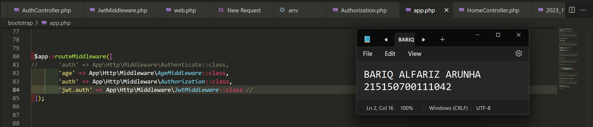

# :ledger: Praktikum JSON Web Token (JWT)
Praktikum ini dilakukan pada 1 November 2023. Pada repository ini berisikan source code dan screenshot penerapan dari praktikum modul 9 mengenai JSON Web Token (JWT)

## Tujuan
Setelah mengikuti praktikum ini, mahasiswa diharapkan dapat:
1. Memahami konsep JWT
2. Mengimplementasikan authorization dengan JWT

## Dasar Teori
### JSON Web Token
JSON Web Token (JWT) adalah standar terbuka yang mendefinisikan cara ringkas dan mandiri untuk transmisi informasi antar pihak secara aman dalam bentuk objek JSON. Informasi ini dapat diverifikasi karena ditandatangani secara digital menggunakan secret key (dengan algoritma HMAC) atau pasangan kunci publik/pribadi menggunakan RSA atau ECSDA

### Penggunaan
- Authorization
    

    Setelah user masuk, setiap request perlu menyertakan. Hal ini mengizinkan user untuk mengakses route, service, dan resource yang diizinkan menggunakan token.
    

- Information Exchange
    

    JWT dapat digunakan untuk mengamankan transmisi data antar pihak. Hal ini dimungkinkan karena JWT dapat ditandatangani untuk memastikan data dikirimkan oleh pengirim yang benar. Penggunaan signature yang dihitung dengan header dan payload dapat memverifikasi data yang dikirimkan tidak diubah di tengah jalan.
    

### Struktur
JSON Web Token menggunakan pola berikut. Header, payload, signature dipisahkan dengan titik.

    xxxxx.yyyyy.zzzzz

- Header

    Berisi algoritma yang digunakan serta jenis token.
    
        {
            "alg": "HS256",
            "typ": "JWT"
        }
    Data di atas akan di-encode menjadi Base64

        eyJhbGciOiJIUzI1NiIsInR5cCI6IkpXVCJ9

- Payload
    Berisi data yang ditransmisikan. Walaupun JWT memastikan dapat yang dikirim tidak diubah, Base64 yang digunakan dapat di-decode. Hal ini membuat JWT tidak dapat digunakan untuk transmisi data rahasia seperti plain text password.

        {
            "sub": "1234567890",
            "name": "Nilou",
            "iat": 1516239022
        }

    Data di atas akan di-encode menjadi Base64
        
        eyJzdWIiOiIxMjM0NTY3ODkwIiwibmFtZSI6Ik5pbG91IiwiaWF0IjoxNTE2MjM5MDIyfQ

- Signature
    Hasil penandatanganan yang dilakukan dengan header dan payload yang sudah di-encode diikuti dengan secret key menggunakan algoritma yang didefinisikan di header.

    Proses penandatanganan menggunakan rumus sebagai berikut
        
        HMACSHA256(
            base64UrlEncode(header) + "." +
            base64UrlEncode(payload),
            secret)

    Yang menghasilkan signature sebagai berikut
        
        58_9vUl1BQN7Fpqs7u7r4tyJC_wvFJ5n4GibGTVnGpU

## Langkah Percobaan
### Penyesuaian Database
1. Lakukan perubahan pada length kolom token dengan menghapus `parameter 72` di belakangnya
    

2. Jalankan perintah di bawah ini `php artisan migrate:fresh` untuk memperbaharui migrasi dan menghapus data yang lama
    
    
3. Jalankan aplikasi pada endpoint `/auth/register` dengan body berikut.
    
    

### JWT Manual
1. Tambahkan ketiga fungsi berikut pada `AuthController.php`
    
    
2. Lakukan perubahan pada fungsi `login`
    
    
3. Tambahkan keempat fungsi berikut pada `Middleware/Authorization.php`
    
    
4. Lakukan perubahan pada fungsi `handle`
    
    
5. Jalankan aplikasi pada endpoint `/auth/login` dengan body berikut. Salinlah token yang didapat ke notepad
    
    
6. Jalankan aplikasi pada endpoint `/home` dengan melampirkan nilai token yang didapat setelah login pada header
    
    

### JWT Library
1. Lakukan generate jwt key secara online menggunakan website `Djecrety ― Django Secret Key Generator`
    
    
    Setelah mendapatkan secret key kita akan memasukkan secret key tersebut pada file `.env` dengan membuat variable baru bernama `JWT_SECRET`
    

2. Lakukan instalasi package jwt firebase dengan menggunakan command 
    
        composer require firebase/php-jwt

    
    

3. Tambahkan fungsi berikut pada file `AuthController`
    
    
4. Lakukan perubahan pada fungsi `login` menjadi seperti berikut
    
    
5. Buatlah file `JwtMiddleware.php` dan isikan baris code berikut
    
    
6. Daftarkan middleware yang telah dibuat pada `bootstrap/app.php`
    
    
7. Tambahkan baris berikut pada file `web.php`
    
    
8. Jalankan aplikasi pada endpoint `/auth/login` dengan body berikut. Salinlah token yang didapat ke notepad
    
    
9. Jalankan aplikasi pada endpoint `/home` dengan melampirkan nilai token yang didapat setelah login pada header
    
    
